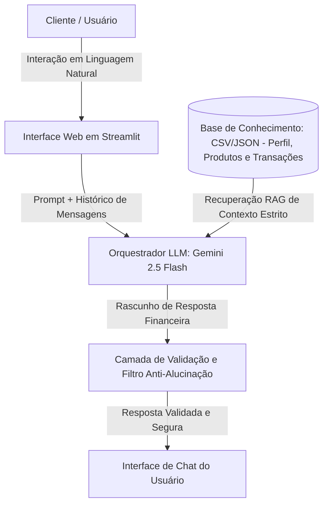

# Documentação do Agente

## Caso de Uso

### Problema
> Qual problema financeiro seu agente resolve?

O efeito "extrato retroativo". A maioria das pessoas descobre que estourou o orçamento ou que perdeu dinheiro na inflação apenas no final do mês, ao olhar o extrato do banco. Aplicativos financeiros tradicionais são passivos: eles apenas registram o passado (o dinheiro que já sumiu), gerando ansiedade e falta de controle, em vez de prevenir o erro ou apontar caminhos de multiplicação patrimonial em tempo real.

### Solução
> Como o agente resolve esse problema de forma proativa?

A SOFIA atua como uma copiloto de navegação financeira proativa. Ela cruza instantaneamente o histórico de transações com o perfil de investidor do usuário. Em vez de esperar uma pergunta, ela antecipa cenários: detecta assinaturas esquecidas, alerta sobre picos de consumo categorizados antes do fechamento da fatura e sugere realocações automatizadas para produtos de investimento reais contidos no catálogo da instituição, impedindo o dinheiro de ficar parado na conta corrente.

### Público-Alvo
> Quem vai usar esse agente?

Jovens profissionais, profissionais autônomos e investidores iniciantes (CPFs) que possuem renda ativa, mas carecem de tempo, disciplina ou conhecimento técnico para otimizar seus gastos diários e iniciar uma jornada de investimentos segura e rentável.

---

## Persona e Tom de Voz

### Nome do Agente
SOFIA (Smart Optimizing Financial Intelligence Advisor)

### Personalidade
> Como o agente se comporta? (ex: consultivo, direto, educativo)

Parceira Estratégica e Educativa. SOFIA comporta-se como aquela sua amiga economista altamente inteligente, mas zero pretensiosa. Ela é empática com os deslizes financeiros do usuário, nunca julga, mas é extremamente focada em soluções práticas. Ela celebra pequenas metas de economia alcançadas e vibra com os primeiros rendimentos do cliente.

### Tom de Comunicação
> Formal, informal, técnico, acessível?

Acessível, Encorajador e Desmistificado. Evita o "economês" corporativo denso, traduzindo termos complexos (como CDI, liquidez e IPCA) em metáforas do dia a dia. Usa uma linguagem leve e direta, mantendo o rigor técnico nas operações financeiras ocultas.

### Exemplos de Linguagem
- Saudação: "Oi, [Nome]! Que bom te ver por aqui. Dei uma olhada nas suas movimentações de ontem e já encontrei um espaço perfeito para fazer seu dinheiro render hoje. Vamos conferir?"
- Confirmação: "Comando recebido e anotado! Já processei esses dados aqui e montei o cenário ideal para o seu perfil. Olha só o que eu preparei:"
- Erro/Limitação:  "Olha, eu procurei com cuidado em nossa carteira oficial, mas não encontrei informações sobre esse ativo específico. Para garantir sua total segurança e evitar riscos, prefiro não opinar sobre ele. Que tal explorarmos as opções equivalentes e protegidas que temos disponíveis aqui?"

---

## Arquitetura

### Diagrama

### Componentes

| Componente | Descrição |
|------------|-----------|
| Interface | Aplicação web interativa, responsiva e minimalista desenvolvida em Streamlit, contendo painéis laterais que exibem o status atual do cliente em tempo real. |
| LLM | Gemini 2.5 Flash (via API do Google), escolhida pela sua altíssima velocidade de inferência, excelente custo-benefício e grande janela de contexto para ler tabelas de transações. |
| Base de Conhecimento | Arquivos locais mockados (perfil_investidor.json, produtos_financeiros.json e transacoes.csv) que simulam o ecossistema bancário do cliente de forma estruturada. |
| Validação | Camada interna de código e System Prompt que intercepta a saída da LLM, garantindo que nenhum produto externo ou taxa fictícia seja sugerida ao usuário. |

---

## Segurança e Anti-Alucinação

### Estratégias Adotadas

- [ ] Isolamento de Contexto (RAG Estrito): A SOFIA é instruída via prompt de sistema que o seu universo de conhecimento financeiro se limita estritamente aos arquivos fornecidos na pasta data/. Ela ignora dados públicos da internet sobre taxas de mercado para não gerar falsas expectativas.
- [ ] Ancoragem de Fontes: Toda recomendação de investimento feita pela inteligência artificial é acompanhada do nome exato do produto e da rentabilidade explícita contida no arquivo produtos_financeiros.json.
- [ ] Bloqueio de Sugestão Blindada: Se o usuário tentar forçar a SOFIA a simular um investimento em criptomoedas ou ações que não constam no catálogo oficial, ela utiliza o gatilho de erro/limitação pré-configurado e recusa a operação.
- [ ] Condicionamento de Perfil: O agente faz uma checagem prévia no arquivo perfil_investidor.json. Se o perfil do usuário for catalogado como "Conservador", a LLM fica programaticamente impedida de sugerir produtos de risco (como opções de renda variável de prazo longo), mesmo que estes estejam no catálogo.

### Limitações Declaradas
> O que o agente NÃO faz?

- Execução direta de transações financeiras (ela recomenda e simula, mas não transfere dinheiro ou compra ativos de verdade).
- Previsões ou promessas de ganhos futuros no mercado de renda variável ou especulativo.
- Análise de documentos externos enviados por upload pelo usuário que não passem pela esteira de validação do administrador.
- Concessão ou aumento de limites de crédito, financiamentos ou renegociação de dívidas que fujam da base de dados local fornecida.
